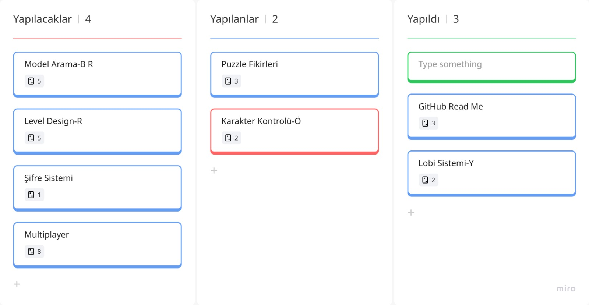
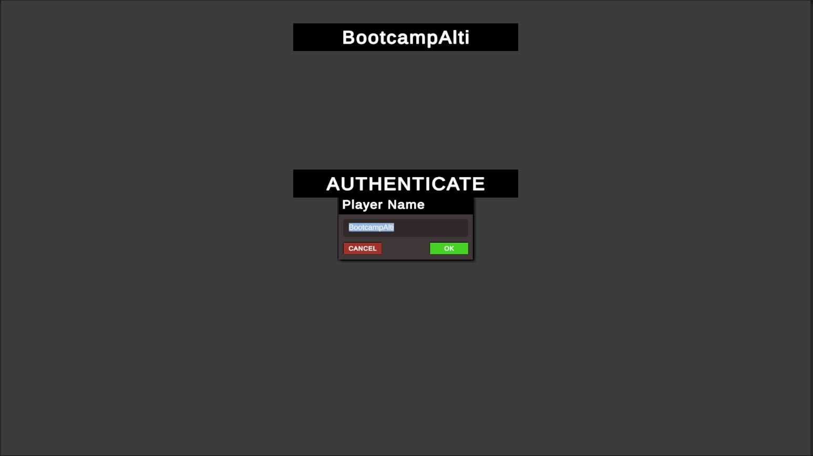
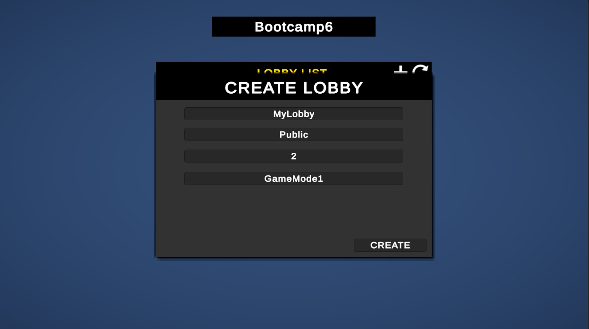
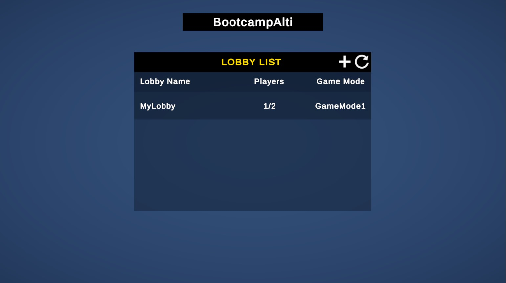
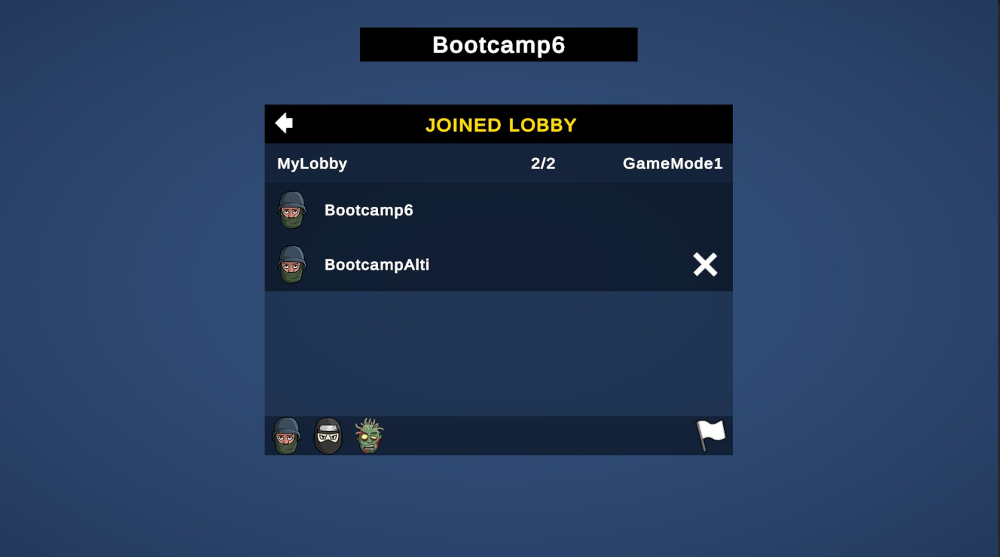

# 🎮 Oyun

## Takım İsmi
**Toplanamayanlar**

## Takım Üyeleri
- **Rana Özcan** - Scrum Master  
- **Yunus Emre Yıldırım** - Product Owner  
- **Batuhan Çetinkaya** - Developer  
- **Ömer Yirmibeş** - Developer  
- **Arzu Ekinli** - Developer  

## Oyun İsmi
**Henüz bulunmadı**

## Oyun Açıklaması

## Oyun Özellikleri
- 3D birinci şahıs kamera ile oynanış
- Co-op veya rekabetçi multiplayer deneyimi
- Oyuncular arasında görev tamamlama ve puan toplama temelli mücadele
- 

## Hedef Kitle
- Eğlenceli ve hızlı tempolu çok oyunculu oyunlara ilgi duyanlar
- Co-op veya rekabetçi mekanikleri deneyimlemek isteyen arkadaş grupları
- Basit görev temelli, puzzle benzeri oyunlardan keyif alan casual oyuncular
- PC oyuncuları
- 7 yaş ve üzeri kullanıcılar

# Sprint 1 - Planlama ve Süreç

## Sprint Hedefleri
Bu sprintte amacımız oyun fikrimizi teknik olarak şekillendirmek ve proje altyapısını hazırlamaktı. Özellikle karakter kontrolü, lobi sistemi ve model arama süreçlerine odaklandık.

---

## Sprint Planı (Sprint Board)

Aşağıda yer alan sprint board ekranı üzerinden görevlerin dağılımı takip edilmiştir:

| Durum        | Görevler                                  |
|--------------|--------------------------------------------|
| Yapılacaklar | Model Arama - Level Design - Şifre Sistemi- Multiplayer |
| Yapılıyor    | Puzzle Fikirleri-Karakter Kontrolü  |
| Yapıldı      | Lobi Sistemi - GitHub ReadMe |

---

## Tahmini Puanlama ve Mantık
- Görevler, karmaşıklıklarına göre 1 ile 5 arasında puanlandı.
- Bu sprintte toplam 8 story point tamamlanması hedeflendi.
- Planlama yapılırken ekip üyelerinin deneyim düzeyi ve önceki görev süreleri dikkate alındı.

---

## Görseller

### Kullanıcı Doğrulama Ekranı

### Lobby Oluşturma Ekranı

### Lobby Listesi

### Lobby Katılım

---

## Sprint Review
- Tamamlanan iş: GitHub ReadMe hazırlığı ve içeriğin oluşturulması ve lobi sistemi.
- Lobi sistemi işlevsel olarak tamamlandı.
- Bazı görevlerde ilerleme olsa da "Done" statüsüne geçen iş sayısı sınırlı kaldı.

---

## Sprint Retrospective
- İyi Gidenler: Görev dağılımı, iletişim ve planlama başarılıydı.  
- Zorlayanlar: Teknik entegrasyonlarda yaşanan ufak gecikmeler.  
- Gelecek Sprint İçin: Bitmemiş işler önceliklendirilip devam edilecek. Görev tamamlama için daha kısa süreli mini hedefler belirlenecek.

---

Hazırlayan: Scrum Master - Rana

**Sprint Retrospective**
 İyi Gidenler: Görev dağılımı, iletişim ve planlama başarılıydı.

 Zorlayanlar: Teknik entegrasyonlarda yaşanan ufak gecikmeler.

 Gelecek Sprint İçin: Bitmemiş işler önceliklendirilip devam edilecek. Görev tamamlama için daha kısa süreli mini hedefler belirlenecek.

